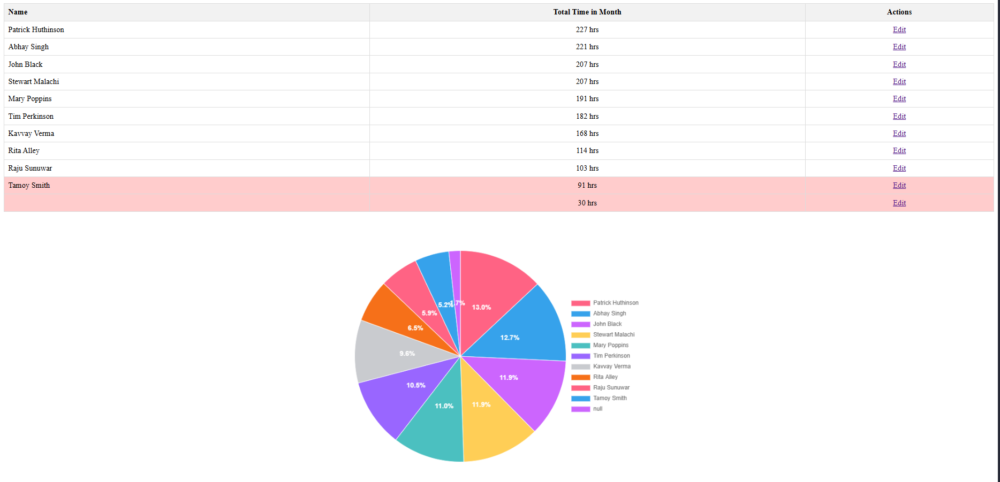
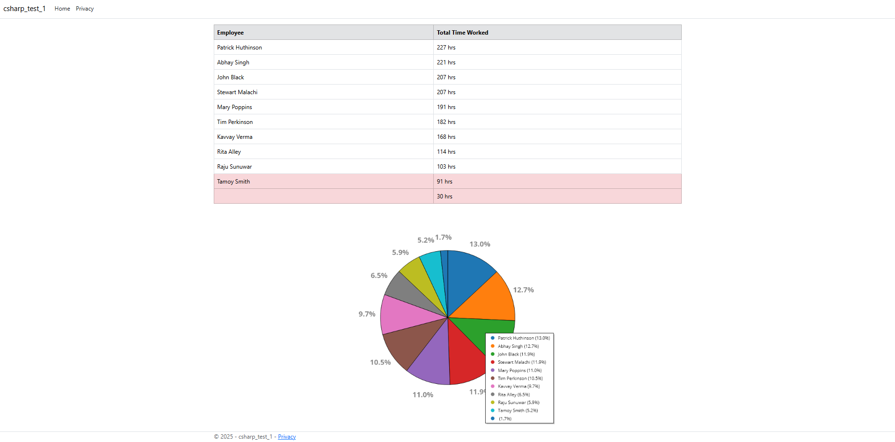

# SoftwareDeveloperTests1

# Angular Test

angularTest1/app/app.html contains the html for the app. 

The logic for the table and charting are in angularTest1/app/app.ts. 

The css is in angularTest1/app/app.css.

# Csharp Test

The builder and initialization are in csharpTest1/Program.cs.

The controller is in csharpTest1/Controllers/HomeController.cs. The chart logic is also included in this file. The chart png is generated using ScottPlot and SkiaSharp.

The EmployeeRecord and Employee classes are in the csharpTest1/Models folder.

The html for the web page is in csharpTest1/Views/Home/Index.cshtml.

